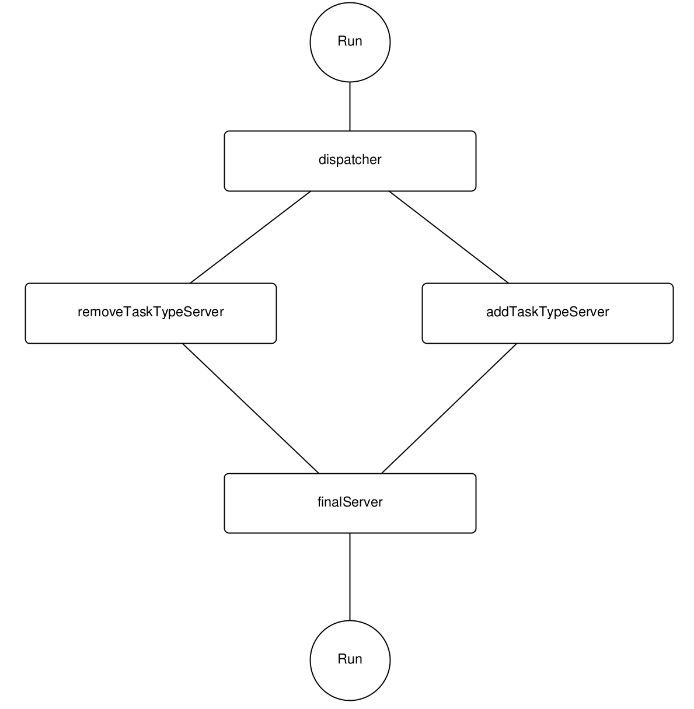

# Домашнее задание № 3
## Работа с github

**Для успешного выполнения домашних заданий вам потребуется:**

1. **Создать персональную копию репозитория**  
   Выполните *fork* данного репозитория на своём аккаунте GitHub — это создаст независимую копию для вашей работы.

2. **Настроить правила:**
   1. Перейдите в `Settings` → `Branches` вашего форка
   2. Добавьте правила для ветки `main`: `Add classic branch protection rule`
   3. Установите `Branch name pattern` = main
   3. Включите опции:
      - Require a pull request before merging
      - Require approvals 
      - Require status checks to pass
      - Do not allow bypassing the above settings

3. **Добавьте ревьюера:**
   1. Перейдите в `Settings` → `Collaborators` вашего форка
   2. В поле `Add people` введите логин GitHub вашего ментора и нажмите Add.
   3. Теперь этот человек будет иметь доступ к вашему форку и вы сможете назначать его ревьюером в PR, созданных внутри вашего форка.

3. **Настроить безопасное подключение**  
   Настройте *SSH-ключ* или получите *токен аутентификации* для безопасного доступа к репозиторию без ввода пароля.

4. **Склонировать репозиторий локально**  
   Используйте команду `git clone` для загрузки репозитория на ваш компьютер.

5. **Создать рабочую ветку**  
   На основе ветки `main` создайте новую ветку с произвольным названием для разработки решения.

6. **Создать go-модуль dz3**  
   go mod init dz3

7. **Реализовать решения задач**  
   В созданной ветке напишите код для задач, разместив решения и тестовые примеры в соответствии со структурой проекта, описанной ниже.

8. **Завершить и проверить решение**  
   После завершения разработки убедитесь, что:
   - Все тесты проходят успешно
   - CI/CD pipeline показывает положительный результат
   - Код соответствует требованиям

9. **Создать запрос на слияние**  
   Отправьте *Pull Request* для объединения вашей ветки с веткой main вашего репозитория (а не основного!).

10. **Получите одобрение ментора**  
   Напишите ментору в телеграмм и дождитесь его обратной связи (возможно придётся исправить!)

**Важно:** Сохраняйте соответствие структуре проекта и обеспечивайте прохождение всех автоматических проверок перед отправкой работы.

Гайд по созданию персональной копии репозитория и аутентификации есть [здесь](./guide_git/readme.md)

## Структура проекта
```
.
├── cmd
│   └── main.go
├── go.mod
├── internal
│   ├── task
│   │   └── task.go // писать код тута
│       └── task_test.go
├── readme.md
└── readme.pdf
```

## Общие требования

## Задача:

### Контекст

В данной задаче требуется реализовать систему для конкурентной обработки клиентских транзакций с использованием горутин и каналов в языке Go. Клиенты характеризуются идентификатором, типом операции (Add или Remove) и балансом. Обработка происходит в несколько этапов с модификацией баланса на каждом этапе.

### Описание

Необходимо реализовать функции для организации конвейерной обработки клиентов: диспетчер распределяет клиентов по типам операций, специализированные серверы изменяют баланс, финальный сервер применяет итоговые преобразования и устанавливает статус операции как завершенный (Done).

### Требования к реализации

Напишите функции:
```go
func dispatcher(input <-chan *Client, remove chan<- *Client, add chan<- *Client, wg *sync.WaitGroup)

func removeTaskTypeServer(remove <-chan *Client, processedRemove chan<- *Client, wg *sync.WaitGroup)

func addTaskTypeServer(add <-chan *Client, processedAdd chan<- *Client, wg *sync.WaitGroup)

func finalServer(processedRemove <-chan *Client, processedAdd chan<- *Client, wg *sync.WaitGroup)

func Run(clients *[]Client)
```

dispatcher: получает клиентов из канала input и направляет их в канал remove или add в зависимости от поля Type.

removeTaskTypeServer: для клиентов из канала remove уменьшает Balance на 100 и отправляет в processedRemove.

addTaskTypeServer: для клиентов из канала add увеличивает Balance на 100 и отправляет в processedAdd.

finalServer: для клиентов из processedRemove увеличивает Balance в 1.5 раза (кэшбэк) и устанавливает Type = Done; для клиентов из processedAdd уменьшает Balance в 2 раза (налоги 0_0) и устанавливает Type = Done.

Run: организует каналы, запускает горутины, отправляет клиентов в input, ждет завершения всех горутин.



### Пример работы

В файле cmd/main.go приведен пример списка клиентов. После выполнения Run(clients) балансы клиентов изменяются согласно логике обработки, а тип устанавливается в Done.

### Технические требования

- Использовать каналы для передачи данных между горутинами.
- Использовать sync.WaitGroup для синхронизации завершения горутин.
- Обеспечить корректную обработку всех клиентов без потери данных.
- Код должен компилироваться и проходить все предоставленные тесты.
- Задачка со звездочкой (необязательная) - сделайте так, что функции removeTaskTypeServer и addTaskTypeServer могут работать в нескольких экземплярах. Это нужно для того, чтобы на более сложные задачи можно было выделить больше обработчиков.

### Советы по реализации

- В функциях использовать defer wg.Done() для корректного учета завершения горутины.
- Использовать цикл for client := range channel или select для чтения из каналов.
- В Run использовать буферизованные каналы с достаточным размером буфера.
- Не забывайте закрывать каналы.